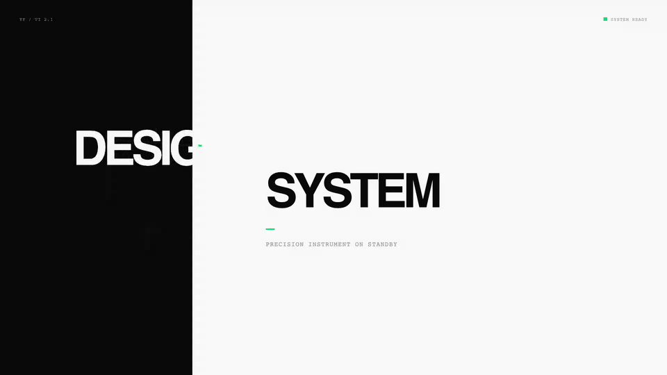
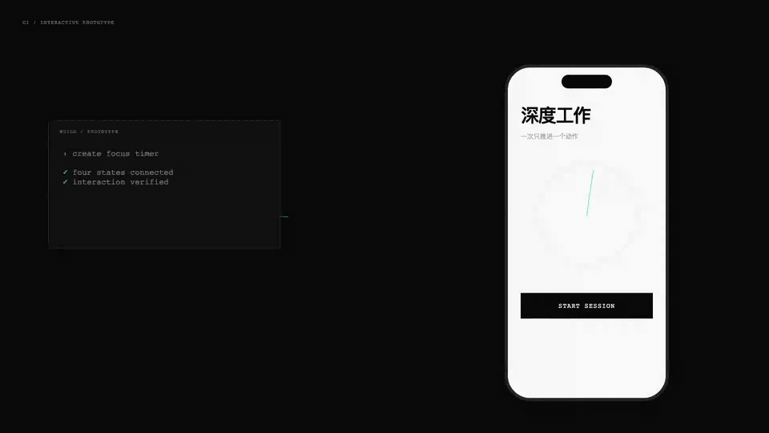
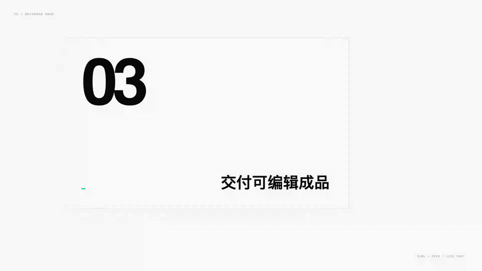
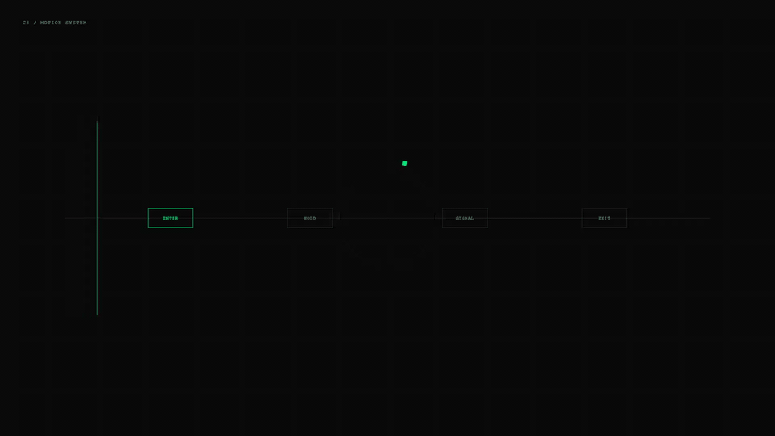
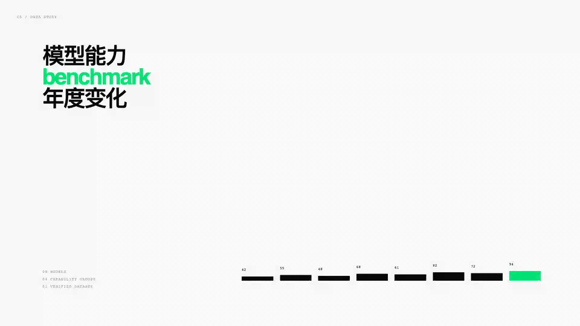
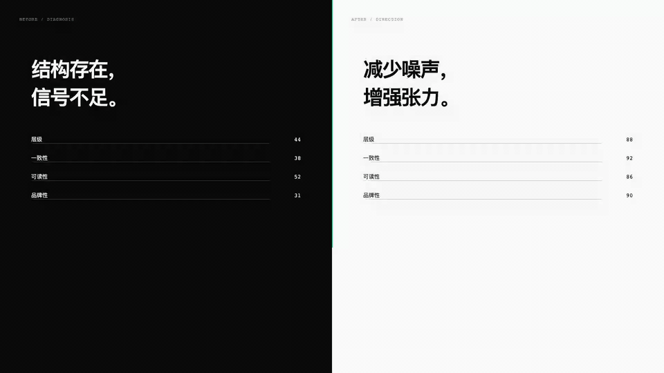
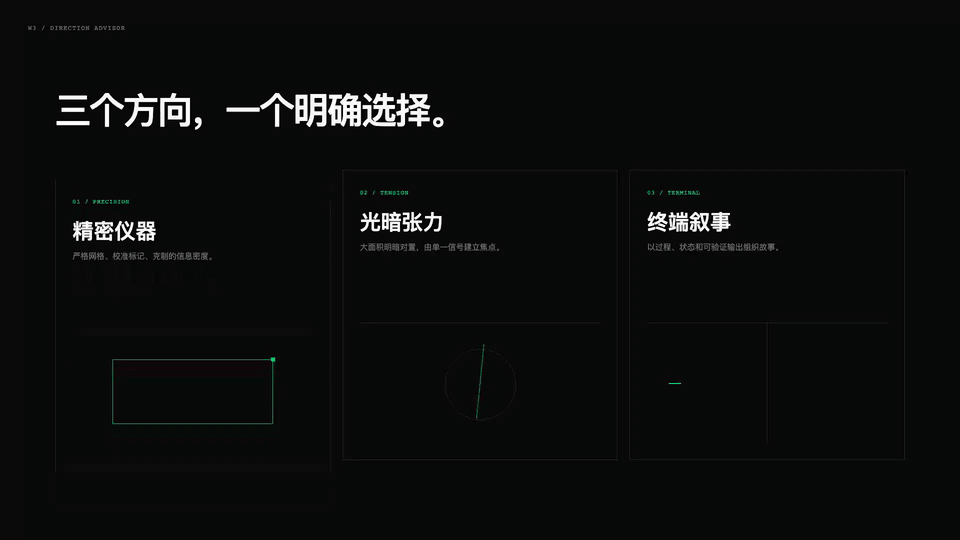

# Design Agent Skills

面向设计产出的 Agent Skill 集合。每个子 skill 独立封装可复用的工作流、资源与验证要求。

> `yy-design` 已从独立仓库迁移至此，原仓库保留为只读历史记录。

## Skills

| Skill | 用途 | 路径 |
| --- | --- | --- |
| `yy-design` | 创建与评审高保真 HTML 原型、交互 Demo、HTML 幻灯片、动画、信息图及公众号视觉产物 | [`skills/yy-design`](skills/yy-design) |

## 安装

使用 [Skills CLI](https://www.skills.sh/docs/cli) 从 GitHub 安装指定子 skill：

```bash
npx skills add wangyiyang/design-agent-skills --skill yy-design
```

该命令默认安装到当前项目中自动检测到的 Agent 目录。若要为 Codex 全局安装：

```bash
npx skills add wangyiyang/design-agent-skills --skill yy-design -g -a codex -y
```

在仓库开发阶段，可先确认 CLI 是否识别到该 skill：

```bash
npx skills add . --list
```

## yy-design

`yy-design` 将 YY Design 的设计工作流收敛为本仓库的子 skill。它强调从现有设计上下文和真实品牌资产出发，先建立视觉系统，再交付可运行且经过浏览器验证的 HTML 产物。

适用请求包括：

- “做一个可点击的 iOS 原型”
- “给这个品牌做 30 秒发布动画，并导出 MP4/GIF”
- “为我的演示文稿提供三套设计方向”
- “评审这个页面并给出可执行的修复清单”

子 skill 内包含按需加载的参考资料、可复用样式和设备框架，以及 HTML 验证和公众号渲染脚本。详见 [`skills/yy-design/SKILL.md`](skills/yy-design/SKILL.md)。

## VI v2.1 示例

以下示例统一使用碳黑 `#0A0A0A`、米白 `#FAFAFA` 与终端绿 `#00E676`，采用无衬线排印、几何构图和单点信号表达。生成源、GIF 和 MP4 分别位于 [`assets/showcase`](skills/yy-design/assets/showcase)、[`assets/gifs`](skills/yy-design/assets/gifs) 和 [`assets/videos`](skills/yy-design/assets/videos)。

### 品牌 Hero



### iOS 原型



### 幻灯片与可编辑 PPTX



### 动效系统



### 信息图



### 专家评审



### 设计方向顾问



## 验证

```bash
python3 -m unittest tests/test_yy_design_skill.py
npx skills add . --list
```
