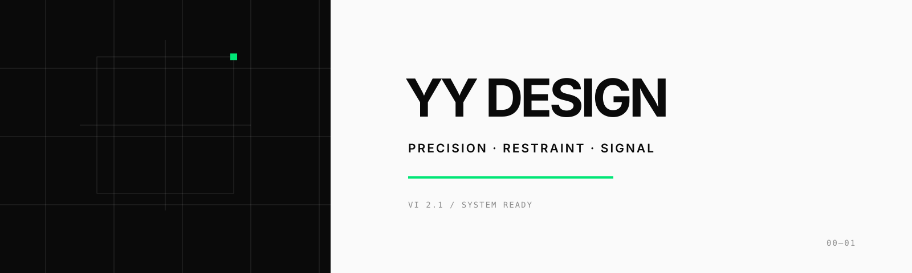

<div align="center">
  
</div>

# YY Design

一句话，让 Agent 交付可运行、可验证的设计成品。

`yy-design` 是面向 HTML 原型、交互 Demo、幻灯片、动画、信息图、设计方向和专家评审的 Agent Skill。涉及翊行代码、YY、王翊仰或 `wangyiyang.cc` 时，自动采用 VI v2.1：碳黑、米白、终端绿，无衬线排印，精密仪器般的克制表达。

## 安装

```bash
npx skills add wangyiyang/design-agent-skills --skill yy-design
```

为 Codex 全局安装：

```bash
npx skills add wangyiyang/design-agent-skills --skill yy-design -g -a codex -y
```

## 能力

| 需求 | 主要交付物 |
| --- | --- |
| App / Web 原型 | 可点击单文件 HTML、核心路径验证 |
| 幻灯片 | HTML deck、可编辑 PPTX |
| 动画与视频 | HTML 动画、MP4、GIF |
| 信息图 | HTML、PNG、PDF 或 SVG |
| 设计方向 | 三版真实视觉初稿（秒数轮盘/现实参照/最佳设计师三套逻辑并行），选定后深化 |
| 专家评审 | 问题诊断、Keep/Fix、可执行修改 |
| 公众号视觉 | 符合 VI 的内联 HTML 与配图 |

## 新 VI 动态示例

每个示例均由 [`assets/showcase`](assets/showcase) 中的新源文件生成，并提供 GIF 与 1920×1080 MP4。

### 品牌视觉系统


### iOS 交互原型


### 幻灯片与可编辑 PPTX


### 动效系统


### 信息图


### 专家评审


### 设计方向顾问


## 使用

安装后直接描述目标和交付格式：

```text
做一个专注计时器的 iOS 原型，包含四个可点击状态。
把这份产品逻辑做成 30 秒动画，导出 MP4 和 GIF。
为这套演示文稿提供三个不同方向，再生成可编辑 PPTX。
按五个维度评审这个页面，并给出优先级明确的修改清单。
```

工作流、资源路由和验证要求见 [`SKILL.md`](SKILL.md)，翊行代码品牌规范见 [`references/yy-vi-v2.md`](references/yy-vi-v2.md)（公众号 / 博客 / 生图 prompt 规范同目录）。

> 本 skill 的设计方法论上游为 [huashu-design](https://github.com/wangyiyang/huashu-design)，最近对齐日期 2026-07-29；品牌层（VI / 公众号 / 博客 / Prompt Kit）权威来源为 Notion「YY · Personal Brand Prompt Kit」。
